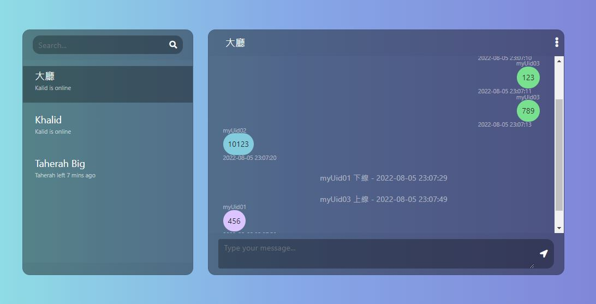
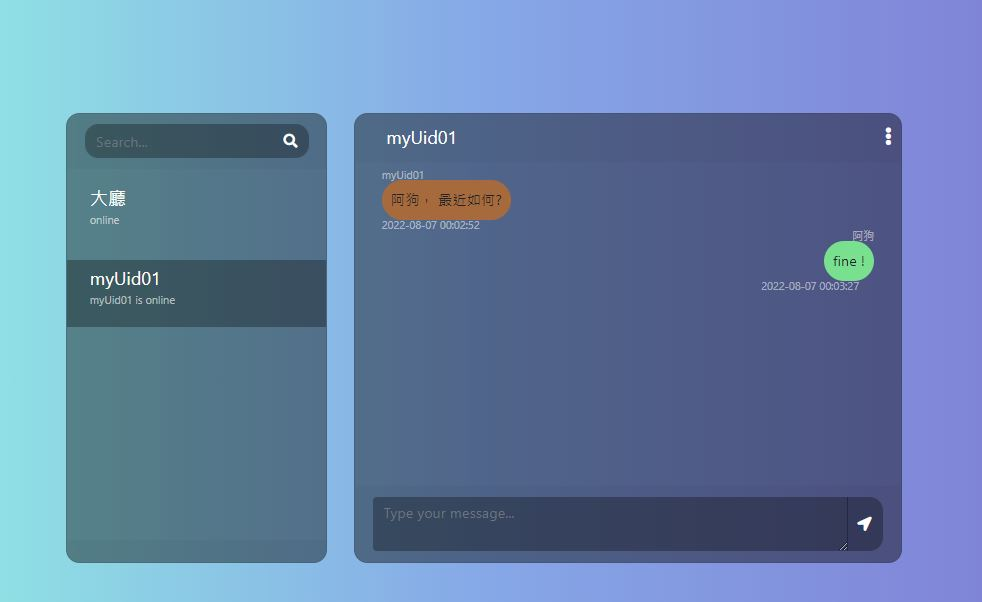

# sample
## 大廳

## 私訊


# start
- 監聽127.0.0.1:2000
- 不同worker(proccess/進程)不能溝通
- connect id 編制規則為: workerId_connectId

# data from client
- type : message/info/bind。message表示當通訊用。info表示獲取worker相關資訊。bind表示綁定uid。
- to : user/all。user表示一對一，all表示一對全部。
- msg : 信息內容。
- to_user : 當to這個key為user時，就會判讀to_user來決定要傳給哪個收訊息的人，此處填寫connection_id。
- uid : user獨立的ID。bindUid時要用的。


# REF
- [official github](https://github.com/walkor/workerman)
- [程序(進程)、執行緒(線程)、協程，傻傻分得清楚！](https://oldmo860617.medium.com/%E9%80%B2%E7%A8%8B-%E7%B7%9A%E7%A8%8B-%E5%8D%94%E7%A8%8B-%E5%82%BB%E5%82%BB%E5%88%86%E5%BE%97%E6%B8%85%E6%A5%9A-a09b95bd68dd)
- [实时通信的「聊天室」源码，Ctrl+c/v就可以用！！！](https://blog.51cto.com/u_15076218/2607210)
- [使用 Workerman 做一个聊天室](https://learnku.com/articles/30160)
# return message sample
- data.type 狀態 : onConnect/onMessage/onClose/onGroup/onBind/infor/
- onConnect : 群體訊息/自己
- onMessage : 一對一聊天
- onClose : 群體訊息
- onGroup : 群體訊息
- onBind : 群體訊息
- info : 發送者才收的到

```json
{
    "status" : 200,
    "message" : "success !",
    "data" : {
        "type" : "onConnect"
        //.......
    },
    "datetime":"2022-08-06 13:23"
}
```
# Demo
```js
//在chrome瀏覽器開發模式輸入底下

ws = new WebSocket("ws://localhost:2000");
ws.onopen = function() {
    console.log("连接成功");
    ws.send('tom');
    console.log("给服务端发送一个字符串：tom");
};
ws.onmessage = function(e) {
    console.log("收到服务端的消息：");
    try{
        console.log(JSON.parse(e.data));
    }catch(exception){
        console.log(e.data);
    }
};

msg={
    type : 'bind',
    uid : 'abc123'
};
ws.send(JSON.stringify(msg));

msg={
    type:'message',
    to:'user',
    msg:'安安你好',
    to_user:'0_2'
};
ws.send(JSON.stringify(msg));

msg={
    type:'message',
    to:'all',
    msg:'大家好',
};
ws.send(JSON.stringify(msg));

msg={
    type:'info'
};
ws.send(JSON.stringify(msg));
```

## Available commands
```php start.php start  ```  
```php start.php start -d  ```  
```php start.php status  ```  
```php start.php status -d  ```  
```php start.php connections```  
```php start.php stop  ```  
```php start.php stop -g  ```  
```php start.php restart  ```  
```php start.php reload  ```  
```php start.php reload -g  ```

# Workerman
[](https://gitter.im/walkor/Workerman?utm_source=badge&utm_medium=badge&utm_campaign=pr-badge&utm_content=body_badge)
[](https://packagist.org/packages/workerman/workerman)
[](https://packagist.org/packages/workerman/workerman)
[](https://packagist.org/packages/workerman/workerman)
[](https://packagist.org/packages/workerman/workerman)
[](https://packagist.org/packages/workerman/workerman)

## What is it
Workerman is an asynchronous event-driven PHP framework with high performance to build fast and scalable network applications. 
Workerman supports HTTP, Websocket, SSL and other custom protocols. 
Workerman supports event extension.

## Requires
PHP 7.0 or Higher  
A POSIX compatible operating system (Linux, OSX, BSD)  
POSIX and PCNTL extensions required   
Event extension recommended for better performance  

## Installation

```
composer require workerman/workerman
```

## Basic Usage

### A websocket server 
```php
<?php

use Workerman\Worker;

require_once __DIR__ . '/vendor/autoload.php';

// Create a Websocket server
$ws_worker = new Worker('websocket://0.0.0.0:2346');

// Emitted when new connection come
$ws_worker->onConnect = function ($connection) {
    echo "New connection\n";
};

// Emitted when data received
$ws_worker->onMessage = function ($connection, $data) {
    // Send hello $data
    $connection->send('Hello ' . $data);
};

// Emitted when connection closed
$ws_worker->onClose = function ($connection) {
    echo "Connection closed\n";
};

// Run worker
Worker::runAll();
```

### An http server
```php
use Workerman\Worker;

require_once __DIR__ . '/vendor/autoload.php';

// #### http worker ####
$http_worker = new Worker('http://0.0.0.0:2345');

// 4 processes
$http_worker->count = 4;

// Emitted when data received
$http_worker->onMessage = function ($connection, $request) {
    //$request->get();
    //$request->post();
    //$request->header();
    //$request->cookie();
    //$request->session();
    //$request->uri();
    //$request->path();
    //$request->method();

    // Send data to client
    $connection->send("Hello World");
};

// Run all workers
Worker::runAll();
```

### A tcp server
```php
use Workerman\Worker;

require_once __DIR__ . '/vendor/autoload.php';

// #### create socket and listen 1234 port ####
$tcp_worker = new Worker('tcp://0.0.0.0:1234');

// 4 processes
$tcp_worker->count = 4;

// Emitted when new connection come
$tcp_worker->onConnect = function ($connection) {
    echo "New Connection\n";
};

// Emitted when data received
$tcp_worker->onMessage = function ($connection, $data) {
    // Send data to client
    $connection->send("Hello $data \n");
};

// Emitted when connection is closed
$tcp_worker->onClose = function ($connection) {
    echo "Connection closed\n";
};

Worker::runAll();
```

### Enable SSL
```php
<?php

use Workerman\Worker;

require_once __DIR__ . '/vendor/autoload.php';

// SSL context.
$context = [
    'ssl' => [
        'local_cert'  => '/your/path/of/server.pem',
        'local_pk'    => '/your/path/of/server.key',
        'verify_peer' => false,
    ]
];

// Create a Websocket server with ssl context.
$ws_worker = new Worker('websocket://0.0.0.0:2346', $context);

// Enable SSL. WebSocket+SSL means that Secure WebSocket (wss://). 
// The similar approaches for Https etc.
$ws_worker->transport = 'ssl';

$ws_worker->onMessage = function ($connection, $data) {
    // Send hello $data
    $connection->send('Hello ' . $data);
};

Worker::runAll();
```

### Custom protocol
Protocols/MyTextProtocol.php
```php

namespace Protocols;

/**
 * User defined protocol
 * Format Text+"\n"
 */
class MyTextProtocol
{
    public static function input($recv_buffer)
    {
        // Find the position of the first occurrence of "\n"
        $pos = strpos($recv_buffer, "\n");

        // Not a complete package. Return 0 because the length of package can not be calculated
        if ($pos === false) {
            return 0;
        }

        // Return length of the package
        return $pos + 1;
    }

    public static function decode($recv_buffer)
    {
        return trim($recv_buffer);
    }

    public static function encode($data)
    {
        return $data . "\n";
    }
}
```

```php
use Workerman\Worker;

require_once __DIR__ . '/vendor/autoload.php';

// #### MyTextProtocol worker ####
$text_worker = new Worker('MyTextProtocol://0.0.0.0:5678');

$text_worker->onConnect = function ($connection) {
    echo "New connection\n";
};

$text_worker->onMessage = function ($connection, $data) {
    // Send data to client
    $connection->send("Hello world\n");
};

$text_worker->onClose = function ($connection) {
    echo "Connection closed\n";
};

// Run all workers
Worker::runAll();
```

### Timer
```php

use Workerman\Worker;
use Workerman\Timer;

require_once __DIR__ . '/vendor/autoload.php';

$task = new Worker();
$task->onWorkerStart = function ($task) {
    // 2.5 seconds
    $time_interval = 2.5; 
    $timer_id = Timer::add($time_interval, function () {
        echo "Timer run\n";
    });
};

// Run all workers
Worker::runAll();
```

### AsyncTcpConnection (tcp/ws/text/frame etc...)
```php

use Workerman\Worker;
use Workerman\Connection\AsyncTcpConnection;

require_once __DIR__ . '/vendor/autoload.php';

$worker = new Worker();
$worker->onWorkerStart = function () {
    // Websocket protocol for client.
    $ws_connection = new AsyncTcpConnection('ws://echo.websocket.org:80');
    $ws_connection->onConnect = function ($connection) {
        $connection->send('Hello');
    };
    $ws_connection->onMessage = function ($connection, $data) {
        echo "Recv: $data\n";
    };
    $ws_connection->onError = function ($connection, $code, $msg) {
        echo "Error: $msg\n";
    };
    $ws_connection->onClose = function ($connection) {
        echo "Connection closed\n";
    };
    $ws_connection->connect();
};

Worker::runAll();
```


## Available commands
```php start.php start  ```  
```php start.php start -d  ```  
```php start.php status  ```  
```php start.php status -d  ```  
```php start.php connections```  
```php start.php stop  ```  
```php start.php stop -g  ```  
```php start.php restart  ```  
```php start.php reload  ```  
```php start.php reload -g  ```

## Documentation

中文主页: [http://www.workerman.net](https://www.workerman.net)

中文文档: [http://doc.workerman.net](https://www.workerman.net/doc/workerman/)

Documentation: [https://github.com/walkor/workerman-manual](https://github.com/walkor/workerman-manual/blob/master/english/SUMMARY.md)

# Benchmarks
https://www.techempower.com/benchmarks/#section=data-r19&hw=ph&test=plaintext&l=zik073-1r


## Other links with workerman

[webman](https://github.com/walkor/webman)   
[PHPSocket.IO](https://github.com/walkor/phpsocket.io)   
[php-socks5](https://github.com/walkor/php-socks5)  
[php-http-proxy](https://github.com/walkor/php-http-proxy)  

## Donate
<a href="https://www.paypal.com/cgi-bin/webscr?cmd=_s-xclick&hosted_button_id=UQGGS9UB35WWG"></a>

## LICENSE

Workerman is released under the [MIT license](https://github.com/walkor/workerman/blob/master/MIT-LICENSE.txt).
